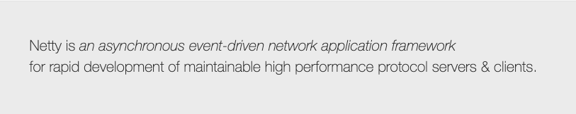
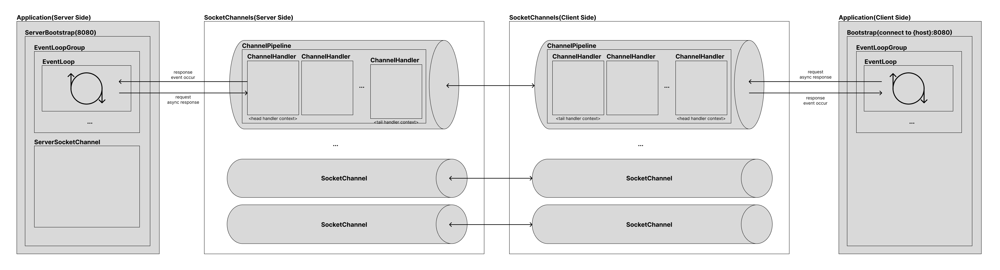

# Netty

[Netty user guide for 4.x](https://netty.io/index.html)

Netty는 `비동기 네트워크 프레임워크`이다. 
클라이언트는 각각의 `소켓채널`을 이용해 `서버소켓채널`에 연결하고 서버에서는 미리 그룹으로 정의한 `이벤트 루프 스레드`들에 각각의 클라이언트를 배정해 요청을 처리한다. 
같은 이벤트 루프 스레드와 연결된 채널 요청에 한해서 순서가 보장된다.   

## NettyArchitecture (임시)

## EventLoopWorkingFlow
